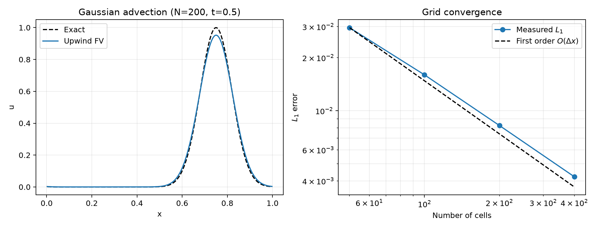

# Adaptive Mesh Refinement for PDEs

A scientific Python project building a validated adaptive mesh refinement (AMR) framework from a conservative uniform-grid foundation. The current `v0.1` stage solves one-dimensional constant-coefficient linear advection; AMR is deliberately deferred until this baseline is verified.



## Current capabilities

- Uniform, cell-centred one-dimensional finite-volume grid
- First-order upwind flux for positive, zero, and negative velocities
- Periodic ghost-cell boundary conditions
- CFL-controlled forward-Euler timestepping with an exact final time
- Gaussian, square-pulse, and sinusoidal periodic profiles
- Exact translated solutions, $L_1$, $L_2$, and $L_\infty$ errors
- Discrete mass-conservation diagnostics and a reproducible convergence benchmark

The solved equation is

$$
\frac{\partial u}{\partial t}+a\frac{\partial u}{\partial x}=0.
$$

The conservative update and upwind flux are documented in [docs/numerical_methods.md](docs/numerical_methods.md). Validation methodology is described in [docs/validation.md](docs/validation.md).

## Phase 1 validation

A Gaussian of width $0.07$ was transported to $t=0.5$ on the periodic domain $[0,1)$, using $a=1$ and $C_{\mathrm{CFL}}=0.8$. These values are generated by `examples/advection_1d/run_gaussian.py` and stored in the benchmark CSV.

| Cells | $L_1$ | $L_2$ | $L_\infty$ | Observed $L_1$ order | Absolute mass error |
|---:|---:|---:|---:|---:|---:|
| 50  | 2.9581e-2 | 5.0971e-2 | 1.6042e-1 | —     | 2.78e-17 |
| 100 | 1.5982e-2 | 2.8069e-2 | 8.9690e-2 | 0.888 | 8.33e-17 |
| 200 | 8.2487e-3 | 1.4641e-2 | 4.7396e-2 | 0.954 | 2.78e-17 |
| 400 | 4.2252e-3 | 7.5427e-3 | 2.4571e-2 | 0.965 | 2.78e-17 |

The observed order tends toward the expected first-order behaviour. Mass conservation is at floating-point roundoff for all four cases. This validates the present uniform solver; it does not yet establish any AMR performance claim.

## Installation

Python 3.10 or newer is required. From the repository root:

```bash
python -m venv .venv
python -m pip install -e ".[test]"
```

## Usage and validation

Run the automated tests and Gaussian convergence benchmark:

```bash
python -m pytest
python examples/advection_1d/run_gaussian.py
```

The benchmark writes measured convergence data to `benchmarks/convergence/` and a validation plot to `figures/`. Results are generated by the implementation and are not hard-coded.

## Repository structure

```text
src/amr/
├── benchmarks/       # Initial conditions and analytical translations
├── diagnostics/      # Error norms and conservation measurements
├── grid/             # UniformGrid1D
├── numerics/         # PDE-independent boundary handling
└── solvers/          # LinearAdvection1D
examples/advection_1d/
tests/
benchmarks/convergence/
figures/
docs/
```

## Limitations

The present scheme is first order and numerically diffusive. Only uniform 1D linear advection is implemented. There is no AMR, higher-order reconstruction, temporal subcycling, coarse-fine boundary treatment, or refluxing yet. Runtime comparisons would therefore be premature.

## Roadmap

The next milestone is basic 1D AMR infrastructure: parent/child patches with refinement ratio two, gradient flagging with buffer cells, and independently tested conservative prolongation and restriction. Dynamic regridding, subcycling, and refluxing will follow in later milestones.

## License

See [LICENSE](LICENSE).
