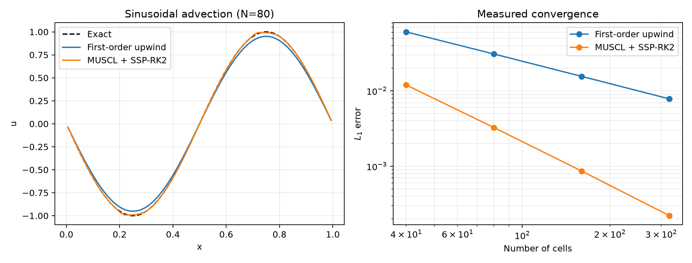
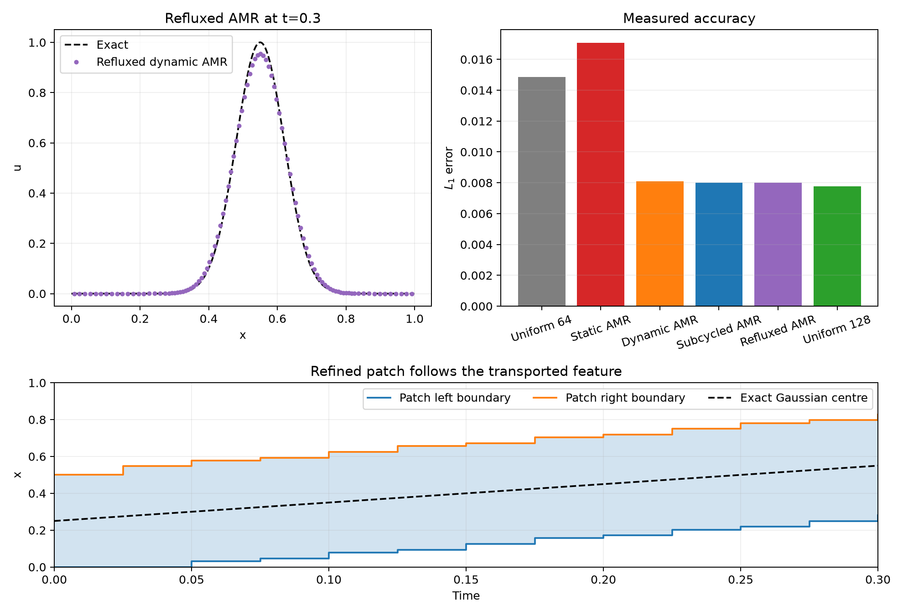
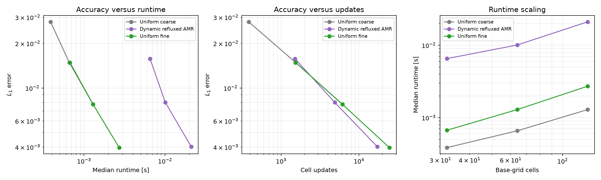
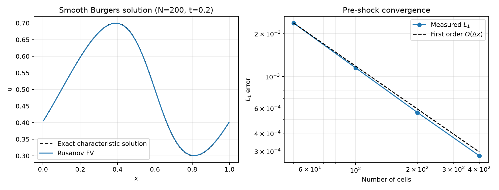
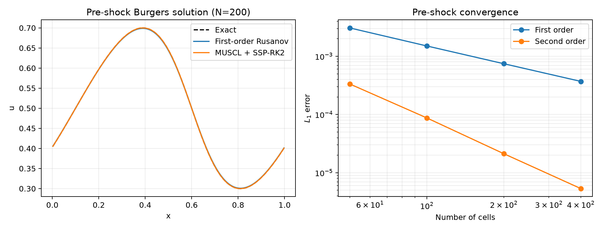
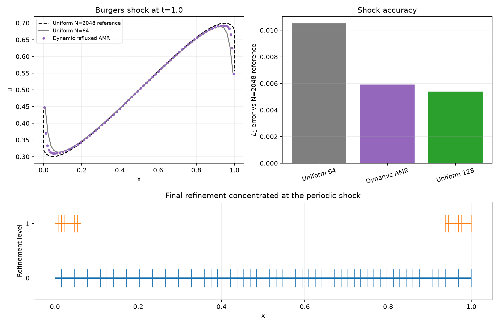
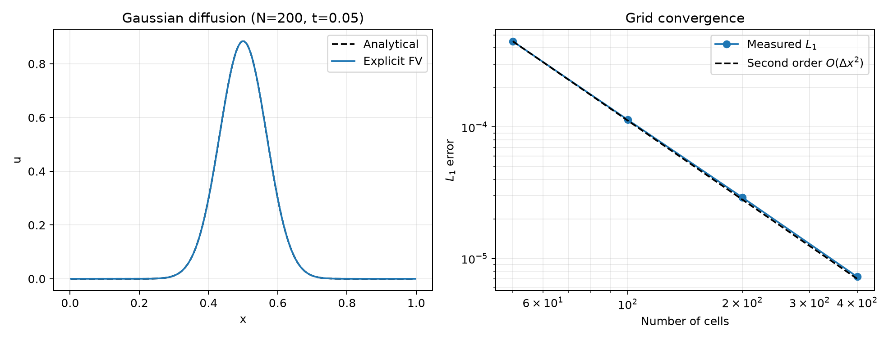
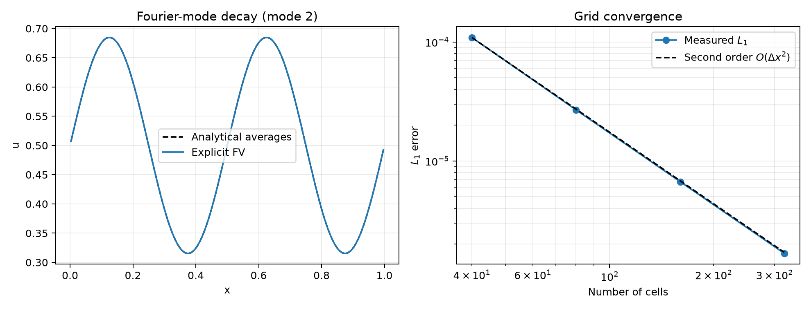
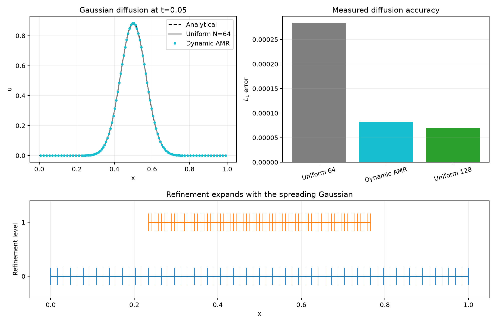
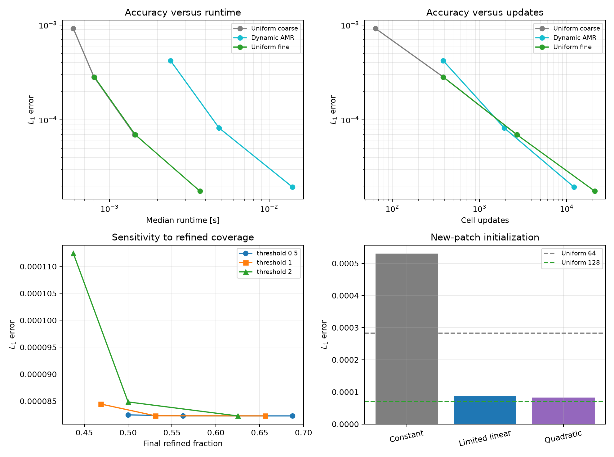

# Adaptive Mesh Refinement for PDEs

[](https://github.com/Bodhisatwa-Datta/adaptive-mesh-refinement/actions/workflows/ci.yml)

A scientific Python project building a validated adaptive mesh refinement (AMR) framework from a conservative uniform-grid foundation. Development is intentionally sequential: the uniform advection solver was established and verified first, and the AMR hierarchy now builds directly on that numerical baseline.


## Current capabilities

- Uniform, cell-centred one-dimensional finite-volume grid
- First-order upwind flux for positive, zero, and negative velocities
- Second-order MC-limited MUSCL advection with SSP-RK2 integration
- Shared tested slope-limiter and reconstruction utilities
- Periodic ghost-cell boundary conditions
- CFL-controlled forward-Euler timestepping with an exact final time
- Gaussian, square-pulse, and sinusoidal periodic profiles
- Exact translated solutions, $L_1$, $L_2$, and $L_\infty$ errors
- Discrete mass-conservation diagnostics and a reproducible convergence benchmark
- Discrete periodic total-variation diagnostics and TVD regression tests
- Tree-structured 1D patches with physical bounds and parent/child relationships
- Integer refinement ratios, with $r=2$ as the default
- Absolute and normalized gradient indicators with configurable thresholds
- Periodic or bounded flag buffering and deterministic region merging
- Conservative constant, limited-linear, and smooth quadratic prolongation
- Conservative average restriction
- Explicit stored-cell and active leaf-cell counts
- Coarse-fine ghost filling with fine-neighbour precedence
- Synchronized one-level AMR advection using a finest-grid global timestep
- Composite-grid error and conservation diagnostics
- Conservative dynamic patch replacement with overlapping fine-data retention
- Configurable regrid intervals and refine/derefine hysteresis
- Regrid event, peak-cell, and cumulative-update diagnostics
- Temporal subcycling with $r$ fine steps per coarse step
- Linear-in-time coarse boundary interpolation during fine substeps
- Flux-register refluxing at coarse-fine interfaces
- Composite conservation to floating-point roundoff with refluxing
- Conservative uniform-grid inviscid Burgers solver with local Rusanov flux
- Second-order MC-limited Burgers solver with Rusanov fluxes and SSP-RK2
- Pre-shock characteristic solution and measured Burgers convergence study
- Dynamic, subcycled, refluxed Burgers AMR with state-dependent CFL control
- Shock-focused refinement and comparison with a high-resolution reference
- Explicit finite-volume diffusion with the parabolic stability restriction
- Analytical periodic Gaussian diffusion and measured second-order convergence
- Exact analytical finite-volume Gaussian cell averages
- Exact finite-volume Fourier-mode decay validation
- Exact discrete Fourier amplification diagnostic for diffusion timesteps
- Limited-linear monotone transfer and smooth quadratic transfer
- Dynamic, refluxed AMR diffusion with linear coarse-fine interpolation
- Parabolic subcycling with $r^2$ fine steps per coarse step
- Repeated AMR diffusion accuracy/runtime and refinement-sensitivity benchmarks
- Automated tests on Python 3.10 through 3.13 with GitHub Actions

## Implementation progress

The project has been implemented in a deliberate numerical sequence:

1. A conservative uniform-grid advection solver was implemented and validated against exact periodic translations and a measured convergence study.
2. Tree-structured AMR patches, gradient flagging, conservative level transfers, derefinement, and hierarchy visualization were then added and independently tested.
3. Coarse-fine ghost filling and a synchronized one-level advection update were then coupled to the hierarchy and checked against the exact translated solution.
4. Conservative dynamic regridding with threshold hysteresis was added so refinement follows transported features without changing mass during patch replacement.
5. Temporal subcycling was added so level one takes $r$ steps for each coarse step, using time-interpolated parent data at patch boundaries.
6. Time-integrated flux registers and reflux correction were then added, restoring composite conservation across coarse-fine interfaces.
7. A repeated accuracy/runtime study quantified the gap between update-count compression and Python wall-clock performance.
8. A conservative uniform Burgers solver was implemented and validated in the smooth pre-shock regime.
9. Burgers' equation was coupled to dynamic, subcycled, refluxed AMR and tested through shock formation.
10. A conservative explicit diffusion solver was implemented and validated against analytical periodic Gaussian spreading.
11. Limited-linear conservative prolongation and linear coarse-fine ghost interpolation were added before coupling diffusion to dynamic, refluxed AMR with parabolic subcycling.
12. A repeated diffusion benchmark then measured resolution scaling, update-count compression, runtime, and sensitivity to refinement thresholds and buffer widths.
13. Diffusion validation was corrected to initialize and compare true analytical cell averages; smooth conservative quadratic prolongation then reduced the AMR transfer error close to the uniform fine-grid result.
14. Continuous integration was added to install, compile, and test the complete package across Python 3.10 through 3.13 on every push and pull request.
15. A decaying periodic Fourier mode was added as an independent diffusion validation using exact finite-volume averages.
16. The explicit stencil's exact discrete Fourier amplification factor was exposed and verified against numerical updates from low through Nyquist modes.
17. A second-order uniform advection solver was implemented with limited MUSCL reconstruction and SSP-RK2 integration, then validated against exact periodic translation.
18. The second-order framework was extended to uniform Burgers flow with local Rusanov fluxes and validated before shock formation and through bounded shock evolution.
19. The duplicated limiter implementations were consolidated into one tested reconstruction module shared by both second-order solvers and conservative AMR prolongation.
20. A discrete total-variation diagnostic was added and used to verify TVD behavior for limited square-pulse advection and post-shock Burgers evolution.

The hierarchy is generated directly from solution-based gradient flags and can be advanced with either static or dynamically replaced refined regions.


The solved equation is

$$
\frac{\partial u}{\partial t}+a\frac{\partial u}{\partial x}=0.
$$

The uniform-grid solver also supports inviscid Burgers' equation,

$$
\frac{\partial u}{\partial t}+\frac{\partial}{\partial x}\left(\frac{u^2}{2}\right)=0.
$$

Diffusion is advanced in conservative flux form,

$$
\frac{\partial u}{\partial t}=D\frac{\partial^2u}{\partial x^2},
\qquad F=-D\frac{\partial u}{\partial x}.
$$

The conservative update and upwind flux are documented in [docs/numerical_methods.md](docs/numerical_methods.md). Validation methodology is described in [docs/validation.md](docs/validation.md).

## Uniform-grid advection validation

A Gaussian of width $0.07$ was transported to $t=0.5$ on the periodic domain $[0,1)$, using $a=1$ and $C_{\mathrm{CFL}}=0.8$. These values are generated by `examples/advection_1d/run_gaussian.py` and stored in the benchmark CSV.

| Cells | $L_1$ | $L_2$ | $L_\infty$ | Observed $L_1$ order | Absolute mass error |
|---:|---:|---:|---:|---:|---:|
| 50  | 2.9581e-2 | 5.0971e-2 | 1.6042e-1 | —     | 2.78e-17 |
| 100 | 1.5982e-2 | 2.8069e-2 | 8.9690e-2 | 0.888 | 8.33e-17 |
| 200 | 8.2487e-3 | 1.4641e-2 | 4.7396e-2 | 0.954 | 2.78e-17 |
| 400 | 4.2252e-3 | 7.5427e-3 | 2.4571e-2 | 0.965 | 2.78e-17 |

The observed order tends toward the expected first-order behaviour. Mass conservation is at floating-point roundoff for all four cases. This validates the present uniform solver; it does not yet establish any AMR performance claim.

## Second-order advection validation

For a smooth sinusoid transported to $t=0.5$, the MC-limited MUSCL and SSP-RK2 solver gives:

| Cells | First-order $L_1$ | Second-order $L_1$ | Observed second-order rate |
|---:|---:|---:|---:|
| 40 | 6.0513e-2 | 1.1950e-2 | — |
| 80 | 3.0818e-2 | 3.2556e-3 | 1.876 |
| 160 | 1.5556e-2 | 8.6125e-4 | 1.918 |
| 320 | 7.8157e-3 | 2.2050e-4 | 1.966 |



The limiter keeps an advected square pulse within its initial bounds, while periodic mass remains conserved to roundoff. This higher-order solver is currently uniform-grid only and has not yet been coupled to AMR.

## Static AMR advection validation

A separate benchmark transports the Gaussian to $t=0.1$ using a 64-cell base grid, refinement ratio two, and a static patch selected from the initial gradient plus buffer cells.

| Calculation | Active cells | Cell updates | $L_1$ error | Signed mass change |
|---|---:|---:|---:|---:|
| Uniform 64 | 64 | 512 | 5.2767e-3 | 0.00 |
| Static AMR | 100 | 2176 | 3.1261e-3 | +1.8991e-4 |
| Uniform 128 | 128 | 2048 | 2.6692e-3 | +2.78e-17 |


The static AMR calculation improves on the coarse-grid error and approaches the fine-grid result with fewer active cells. It performs more cell updates than uniform $N=128$ because the synchronized baseline advances covered coarse cells and uses the fine-grid timestep everywhere. This is not an efficiency result, and the measured mass drift shows why coarse-fine flux correction is still required.

## Dynamic refinement validation

The moving-patch benchmark transports a Gaussian from $x=0.25$ to $x=0.55$, rebuilding level one every four fine-grid timesteps. Separate refinement and derefinement thresholds provide hysteresis.

| Calculation | Final active cells | Cell updates | $L_1$ error | Signed mass change |
|---|---:|---:|---:|---:|
| Uniform 64 | 64 | 1536 | 1.4861e-2 | -2.78e-17 |
| Static AMR | 96 | 6144 | 1.7063e-2 | +2.8306e-3 |
| Dynamic AMR | 99 | 6424 | 8.0916e-3 | +9.0057e-5 |
| Subcycled AMR | 99 | 4888 | 8.0001e-3 | -1.4829e-6 |
| Refluxed AMR | 99 | 4888 | 8.0015e-3 | -2.78e-17 |
| Uniform 128 | 128 | 6144 | 7.7606e-3 | 0.00 |



The dynamic patch prevents the feature from leaving the fine region and nearly matches the uniform fine-grid error. Subcycling reduces the update count below uniform $N=128$. Refluxing then reduces the total mass change to floating-point roundoff without materially changing the error. The largest mass change caused by an individual regrid is $8.33\times10^{-17}$.

This demonstrates an update-count advantage for this case, not yet a runtime advantage. Repeated timing measurements and broader resolution studies are still required before making a performance claim.

## Accuracy and runtime assessment

The repeated benchmark uses base grids 32, 64, and 128, compares dynamic refluxed AMR against uniform grids with twice the base resolution, performs one untimed warm-up, and records the median of seven complete runs.

| Base cells | AMR $L_1$ | Fine uniform $L_1$ | AMR updates | Fine updates | AMR median [s] | Fine median [s] |
|---:|---:|---:|---:|---:|---:|---:|
| 32 | 1.5748e-2 | 1.4861e-2 | 1512 | 1536 | 6.540e-3 | 6.71e-4 |
| 64 | 8.0015e-3 | 7.7606e-3 | 4888 | 6144 | 1.008e-2 | 1.292e-3 |
| 128 | 4.0309e-3 | 3.9669e-3 | 17152 | 24576 | 2.104e-2 | 2.717e-3 |



AMR reduces cell updates at the two larger resolutions, but is approximately 8–10 times slower in these measurements. Python-level patch management and frequent regridding dominate the inexpensive first-order stencil. These timings are environment-specific and can be regenerated from the recorded benchmark script and metadata.

## Smooth Burgers validation

The uniform Burgers solver is compared at $t=0.2$ with the characteristic solution for $u_0(x)=0.5+0.2\sin(2\pi x)$. The analytical solution remains smooth until $t_s\approx0.7958$.

| Cells | $L_1$ error | Observed order | Signed mass change |
|---:|---:|---:|---:|
| 50 | 2.3678e-3 | — | -5.55e-17 |
| 100 | 1.1509e-3 | 1.041 | +1.11e-16 |
| 200 | 5.5984e-4 | 1.040 | 0.00 |
| 400 | 2.7838e-4 | 1.008 | 0.00 |



## Second-order Burgers validation

The MC-limited MUSCL/Rusanov solver with SSP-RK2 gives pre-shock $L_1$ errors $3.3435\times10^{-4}$, $8.7400\times10^{-5}$, $2.1226\times10^{-5}$, and $5.3484\times10^{-6}$ on 50, 100, 200, and 400 cells. The observed orders are 1.936, 2.042, and 1.989. At 400 cells its error is about 69 times smaller than the first-order Rusanov result.



Periodic mass is conserved to roundoff, and the limiter keeps the solution within its initial range through the tested post-shock evolution. The higher-order solver is currently uniform-grid only.

## Burgers shock tracking

At $t=1.0>t_s$, the smooth initial condition has formed a periodic shock. Dynamic AMR concentrates level one at that shock and is compared with a uniform $N=2048$ numerical reference.

| Calculation | Final active cells | Cell updates | $L_1$ vs reference | Signed mass change |
|---|---:|---:|---:|---:|
| Uniform 64 | 64 | 3584 | 1.0511e-2 | -2.08e-17 |
| Dynamic refluxed AMR | 72 | 10704 | 5.9122e-3 | 0.00 |
| Uniform 128 | 128 | 14336 | 5.3813e-3 | +2.13e-17 |



The AMR result approaches the uniform 128-cell error with fewer final active cells and fewer updates. The comparison uses a numerical reference rather than an analytical post-shock solution, and no runtime advantage is inferred from update counts alone.

## Diffusion validation

A periodic Gaussian is diffused with $D=0.01$ to $t=0.05$. The centred finite-volume flux and forward-Euler update use $\Delta t\leq C\Delta x^2/(2D)$ with $C=0.8$.

| Cells | $L_1$ error | Observed order | Signed mass change |
|---:|---:|---:|---:|
| 50 | 4.4887e-4 | — | 0.00 |
| 100 | 1.1375e-4 | 1.980 | -2.78e-17 |
| 200 | 2.9126e-5 | 1.965 | +2.78e-17 |
| 400 | 7.2632e-6 | 2.004 | -2.78e-17 |



Initial data and errors use analytical averages integrated over each finite-volume cell, rather than point samples at cell centres. The measured rate is second order in space, and mass remains conserved to floating-point roundoff.

The independent mode-two Fourier benchmark gives successive $L_1$ orders 2.021, 2.005, and 2.001 on 40, 80, 160, and 320 cells. Its displayed mass change is zero at every resolution.



## Dynamic AMR diffusion

The diffusion benchmark uses a 64-cell base grid, refinement ratio two, smooth conservative quadratic prolongation, linear parent ghost interpolation, and four fine steps per coarse step. The refined region expands as the Gaussian spreads.

| Calculation | Final active cells | Cell updates | $L_1$ error | Signed mass change |
|---|---:|---:|---:|---:|
| Uniform 64 | 64 | 384 | 2.8294e-4 | +9.65e-18 |
| Dynamic AMR | 98 | 1920 | 8.2265e-5 | +2.78e-17 |
| Uniform 128 | 128 | 2688 | 6.9719e-5 | +9.85e-18 |



AMR reduces the base-grid error by about 71%, comes within 18% of the uniform 128-cell error, and uses 29% fewer updates. Refluxing preserves mass to roundoff. The update count is not a wall-clock performance result.

## Diffusion accuracy and runtime assessment

The repeated benchmark uses base grids 32, 64, and 128. Each calculation receives one untimed warm-up followed by 15 complete timings that include initialization, initial regridding, integration, and diagnostics.

| Base cells | AMR $L_1$ | Fine uniform $L_1$ | AMR updates | Fine updates | AMR median [s] | Fine median [s] |
|---:|---:|---:|---:|---:|---:|---:|
| 32 | 4.1981e-4 | 2.8294e-4 | 384 | 384 | 2.413e-3 | 8.04e-4 |
| 64 | 8.2265e-5 | 6.9719e-5 | 1920 | 2688 | 4.853e-3 | 1.449e-3 |
| 128 | 1.9494e-5 | 1.7723e-5 | 12192 | 20992 | 1.4023e-2 | 3.683e-3 |



At the two larger base resolutions, AMR reduces fine-grid update counts by approximately 29% and 42%. Its measured $L_1$ convergence orders are approximately 2.35 and 2.08, and its error approaches the uniform fine result as resolution increases. However, it remains 3.0–3.8 times slower than the corresponding uniform fine calculation in this environment.

A nine-case sweep combines refinement thresholds 0.5, 1.0, and 2.0 with buffers of 2, 4, and 8 coarse cells. Most configurations reach the same $8.22\times10^{-5}$ error plateau. The most aggressive threshold with only two buffer cells under-refines the Gaussian and gives $1.12\times10^{-4}$, showing that buffer coverage matters when flagging is restrictive.

The transfer comparison gives $L_1=5.30\times10^{-4}$ for piecewise constant, $8.83\times10^{-5}$ for limited linear, and $8.23\times10^{-5}$ for smooth conservative quadratic initialization. Total and individual-regrid mass changes remain at floating-point roundoff.

## Installation

Python 3.10 or newer is required. From the repository root:

```bash
python -m venv .venv
python -m pip install -e ".[test]"
```

## Usage and validation

Run the automated tests, Gaussian convergence benchmark, and static hierarchy example:

```bash
python -m pytest
python examples/advection_1d/run_gaussian.py
python examples/advection_1d/run_second_order_validation.py
python examples/amr_1d/build_static_hierarchy.py
python examples/amr_1d/run_static_advection.py
python examples/amr_1d/run_dynamic_advection.py
python examples/burgers_1d/run_smooth_validation.py
python examples/burgers_1d/run_second_order_validation.py
python examples/burgers_1d/run_shock_amr.py
python examples/diffusion_1d/run_gaussian_validation.py
python examples/diffusion_1d/run_fourier_validation.py
python examples/diffusion_1d/run_amr_diffusion.py
python benchmarks/performance/run_advection_benchmark.py --repeats 7
python benchmarks/performance/run_diffusion_benchmark.py --repeats 15 --sensitivity-repeats 15
```

The scripts write measured CSV data to `benchmarks/convergence/`, `benchmarks/uniform_vs_amr/`, and `benchmarks/performance/`, with validation plots in `figures/`. Results are generated by the implementation and are not hard-coded.

## Repository structure

```text
src/amr/
├── benchmarks/       # Initial conditions and analytical solutions
├── diagnostics/      # Errors, conservation, and mesh plotting
├── grid/             # Uniform grid, Patch1D, and AMRHierarchy1D
├── numerics/         # PDE-independent boundary handling
├── refinement/       # Criteria, prolongation, and restriction
└── solvers/          # Uniform and one-level AMR PDE solvers
examples/
├── advection_1d/
├── amr_1d/
├── burgers_1d/
└── diffusion_1d/
tests/
benchmarks/
├── convergence/
├── performance/
└── uniform_vs_amr/
figures/
docs/
```

## Limitations

The AMR advection and Burgers solvers still use first-order spatial reconstruction; the second-order advection and Burgers solvers are currently uniform-grid only. Time-dependent AMR supports linear advection, inviscid Burgers' equation, and explicit diffusion on one refined level. Refinement ratio two is the validated time-dependent configuration. Smooth conservative quadratic prolongation is not monotonicity preserving and is used only for the smooth diffusion benchmark; limited-linear transfer remains available for nonsmooth fields. More than one time-dependent fine level is not implemented. Explicit diffusion requires timesteps proportional to $\Delta x^2$, so a ratio-$r$ fine level takes $r^2$ substeps. Repeated advection and diffusion timings show that the current Python AMR implementation is slower than uniform arrays for the tested problem sizes despite reducing update counts.

## Future extensions

Future work can couple the second-order hyperbolic method to AMR, add recursively subcycled multiple refinement levels, and build two-dimensional grid and patch infrastructure. Performance work should profile and reduce Python-level hierarchy and regridding overhead before claiming wall-clock acceleration.

## License

See [LICENSE](LICENSE).
