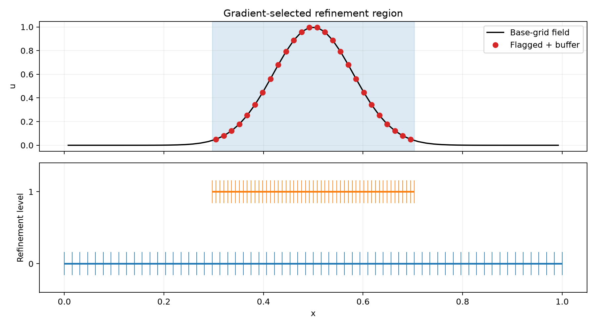
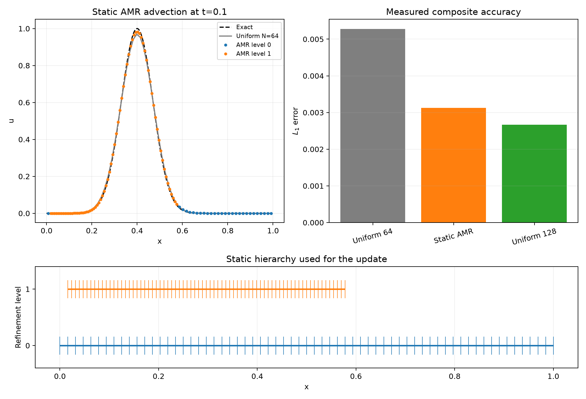

# Adaptive Mesh Refinement for PDEs

A scientific Python project building a validated adaptive mesh refinement (AMR) framework from a conservative uniform-grid foundation. Development is intentionally sequential: the uniform advection solver was established and verified first, and the AMR hierarchy now builds directly on that numerical baseline.


## Current capabilities

- Uniform, cell-centred one-dimensional finite-volume grid
- First-order upwind flux for positive, zero, and negative velocities
- Periodic ghost-cell boundary conditions
- CFL-controlled forward-Euler timestepping with an exact final time
- Gaussian, square-pulse, and sinusoidal periodic profiles
- Exact translated solutions, $L_1$, $L_2$, and $L_\infty$ errors
- Discrete mass-conservation diagnostics and a reproducible convergence benchmark
- Tree-structured 1D patches with physical bounds and parent/child relationships
- Integer refinement ratios, with $r=2$ as the default
- Absolute and normalized gradient indicators with configurable thresholds
- Periodic or bounded flag buffering and deterministic region merging
- Conservative piecewise-constant prolongation and average restriction
- Explicit stored-cell and active leaf-cell counts
- Coarse-fine ghost filling with fine-neighbour precedence
- Synchronized one-level AMR advection using a finest-grid global timestep
- Composite-grid error and conservation diagnostics

## Implementation progress

The project has been implemented in a deliberate numerical sequence:

1. A conservative uniform-grid advection solver was implemented and validated against exact periodic translations and a measured convergence study.
2. Tree-structured AMR patches, gradient flagging, conservative level transfers, derefinement, and hierarchy visualization were then added and independently tested.
3. Coarse-fine ghost filling and a synchronized one-level advection update were then coupled to the hierarchy and checked against the exact translated solution.
4. The next implementation step is dynamic regridding so the refined region can follow the transported feature.

The hierarchy is generated directly from solution-based gradient flags and can now be advanced with a static refined region.



The solved equation is

$$
\frac{\partial u}{\partial t}+a\frac{\partial u}{\partial x}=0.
$$

The conservative update and upwind flux are documented in [docs/numerical_methods.md](docs/numerical_methods.md). Validation methodology is described in [docs/validation.md](docs/validation.md).

## Uniform-grid advection validation

A Gaussian of width $0.07$ was transported to $t=0.5$ on the periodic domain $[0,1)$, using $a=1$ and $C_{\mathrm{CFL}}=0.8$. These values are generated by `examples/advection_1d/run_gaussian.py` and stored in the benchmark CSV.

| Cells | $L_1$ | $L_2$ | $L_\infty$ | Observed $L_1$ order | Absolute mass error |
|---:|---:|---:|---:|---:|---:|
| 50  | 2.9581e-2 | 5.0971e-2 | 1.6042e-1 | —     | 2.78e-17 |
| 100 | 1.5982e-2 | 2.8069e-2 | 8.9690e-2 | 0.888 | 8.33e-17 |
| 200 | 8.2487e-3 | 1.4641e-2 | 4.7396e-2 | 0.954 | 2.78e-17 |
| 400 | 4.2252e-3 | 7.5427e-3 | 2.4571e-2 | 0.965 | 2.78e-17 |

The observed order tends toward the expected first-order behaviour. Mass conservation is at floating-point roundoff for all four cases. This validates the present uniform solver; it does not yet establish any AMR performance claim.

## Static AMR advection validation

A separate benchmark transports the Gaussian to $t=0.1$ using a 64-cell base grid, refinement ratio two, and a static patch selected from the initial gradient plus buffer cells.

| Calculation | Active cells | Cell updates | $L_1$ error | Signed mass change |
|---|---:|---:|---:|---:|
| Uniform 64 | 64 | 512 | 5.2767e-3 | 0.00 |
| Static AMR | 100 | 2176 | 3.1261e-3 | +1.8991e-4 |
| Uniform 128 | 128 | 2048 | 2.6692e-3 | +2.78e-17 |



The static AMR calculation improves on the coarse-grid error and approaches the fine-grid result with fewer active cells. It performs more cell updates than uniform $N=128$ because the synchronized baseline advances covered coarse cells and uses the fine-grid timestep everywhere. This is not an efficiency result, and the measured mass drift shows why coarse-fine flux correction is still required.

## Installation

Python 3.10 or newer is required. From the repository root:

```bash
python -m venv .venv
python -m pip install -e ".[test]"
```

## Usage and validation

Run the automated tests, Gaussian convergence benchmark, and static hierarchy example:

```bash
python -m pytest
python examples/advection_1d/run_gaussian.py
python examples/amr_1d/build_static_hierarchy.py
python examples/amr_1d/run_static_advection.py
```

The benchmark writes measured convergence data to `benchmarks/convergence/` and a validation plot to `figures/`. Results are generated by the implementation and are not hard-coded.

## Repository structure

```text
src/amr/
├── benchmarks/       # Initial conditions and analytical translations
├── diagnostics/      # Errors, conservation, and mesh plotting
├── grid/             # Uniform grid, Patch1D, and AMRHierarchy1D
├── numerics/         # PDE-independent boundary handling
├── refinement/       # Criteria, prolongation, and restriction
└── solvers/          # Uniform and synchronized AMR advection
examples/
├── advection_1d/
└── amr_1d/
tests/
benchmarks/
├── convergence/
└── uniform_vs_amr/
figures/
docs/
```

## Limitations

The advection scheme is first order and numerically diffusive. The AMR hierarchy remains static during integration and currently supports one refined level. There is no dynamic regridding, temporal subcycling, or refluxing. The lack of refluxing produces a measurable composite mass error at coarse-fine interfaces, and runtime comparisons remain premature.

## Roadmap

The next milestone is controlled dynamic regridding with buffered refinement regions and conservative transfer when patches are replaced. Temporal subcycling and refluxing will follow after the moving hierarchy is validated.

## License

See [LICENSE](LICENSE).
